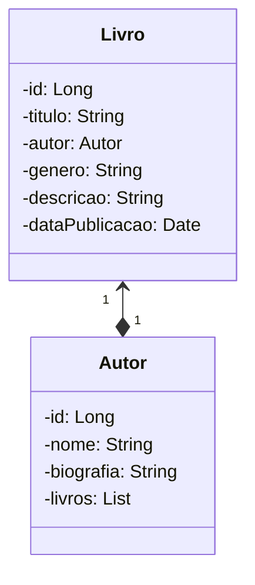

# API de Livros

## Descrição

Esta é uma API desenvolvida em Spring Boot que permite a gestão de livros. A API é parte do projeto do Bootcamp Decola Tech 2025 e oferece funcionalidades para criar, ler, atualizar e deletar informações sobre livros.

## Diagrama de Classes



## Funcionalidades

- **Listar todos os livros**: Endpoint para recuperar todos os livros cadastrados.
- **Buscar livro por ID**: Endpoint para buscar um livro específico através do seu ID.
- **Adicionar um novo livro**: Endpoint para adicionar um novo livro ao catálogo.
- **Atualizar informações de um livro**: Endpoint para atualizar os dados de um livro existente.
- **Deletar um livro**: Endpoint para remover um livro do catálogo.

## Tecnologias Utilizadas

- **Java**: Linguagem de programação.
- **Spring Boot**: Framework para desenvolvimento de aplicações Java.
- **Spring Data JPA**: Para interação com o banco de dados.
- **H2 Database**: Banco de dados em memória para testes.
- **Maven**: Gerenciador de dependências.

## Pré-requisitos

- JDK 11 ou superior.
- Maven instalado.
- IDE (como IntelliJ, Eclipse ou VScode).

## Como Executar o Projeto

1. Clone o repositório:
   ```bash
   git clone https://github.com/seuusuario/api-livros.git
   ```
2. Navegue até o diretório do projeto:
   ```bash
   cd api-livros
   ```
3. Compile e execute o projeto:
   ```bash
   mvn spring-boot:run
   ```
4. Acesse a API pelo endpoint:
   ```
   http://localhost:8080/
   ```

## Contribuições

Contribuições são bem-vindas! Sinta-se à vontade para abrir uma issue ou enviar um pull request.

## Contato

Para dúvidas ou mais informações, entre em contato pelo e-mail: andre.sousamenezes2@gmail.com.
